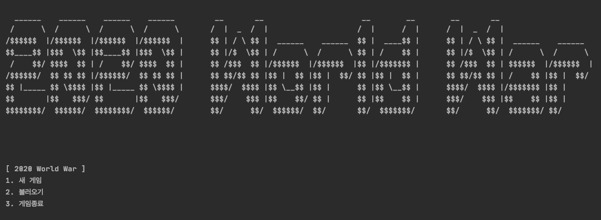

# 자바 슈팅 게임 - 2020 World War

자바를 공부하기 위해 처음 만든 게임 프로젝트

플레이 방법은 clone 혹은 다운로드 후 `Main`을 실행시켜주면 됩니다.

## 느낀 점

만들 때 나름 고민을 많이 했지만, 만들고 나서 느낀 점은 아래와 같다.

* 객체지향의 중요성 -> 객체지향적으로 코드를 작성하지 않아 아쉽다.
  * 모든 소프트웨어 설계는 변경에 유연해야한다.
  * 컴파일타임 의존성과 런타임 의존성이 다르게 만들어야 한다.
  * 상속보다는 합성.
* 동시성 제어의 어려움 -> 아직 동시성 제어가 어렵다.

## 게임 화면

* 첫 화면

* 게임 화면

## 게임 기능

### 컨트롤

1. 방향키 ( →←↑↓) 로 플레이어의 비행기를 움직일 수 있습니다.

2. 스페이스바(SPACE)로 플레이어의 미사일을 발사 할 수 있습니다.

3. 컨트롤(Ctrl)로 플레이어가 장착한 아이템을 사용할 수 있습니다.

4. 제트키(Z)로 각 비행기의 스킬을 사용할 수 있습니다.

### 비행기 ( 플레이어 )

1. F4K - 미사일은 앞으로 한발만 발사하고, 아무 스킬이 없는 기본 비행기입니다.

2. F15K - 미사일이 각각 30도, 0도, -30도로 세 발씩 나가며, 지원사격이라는 스킬을 가지고있는 비행기입니다.

3. F35K - 미사일이 각각 30도, 0도, -30도로 세 발씩 나가며, 스텔스라는 스킬을 가지고 있는 비행기입니다.

### 적 비행기

1. 일반 비행기 - 주기적으로 앞으로 이동하고, 앞으로 한발씩 미사일 발사하는 기본 적 비행기입니다.

   ( HP : 5 )

2. 보스 비행기1 - 이동하지 않고, 각각 30도, 0도, -30도로 세 발씩 미사일을 발사하는 보스 비행기입니다.

   ( HP : 20 )

3. 보스 비행기2 - 위아래로 주기적으로 이동하고, 각각 30도, 0도, -30도로 세 발씩 미사일을 발사하는 보스 비행기입니다. ( HP : 30 )

### 스킬

1. 지원 사격 - 모든 맵에 총알 발사하는 스킬. ( **F15K 비행기 스킬** )

​    ( 쿨타임 : 4초 )

2. 스텔스 - 모든 적들의 총알을 전부 화면에서 없애는 스킬. ( **F35K 비행기 스킬** )

​    ( 쿨타임 : 5초 )

### 아이템

1. HP플러스10 - 플레이어의 HP를 10만큼 높여주는 아이템입니다.

2. HP플러스30 - 플레이어의 HP를 30만큼 높여주는 아이템입니다.

### 게임 저장/불러오기

  \- 직렬화를 통해서 게임저장 및 불러오기를 구현했습니다.